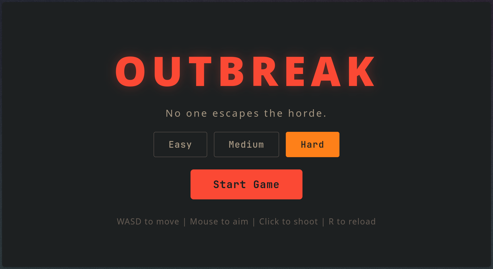
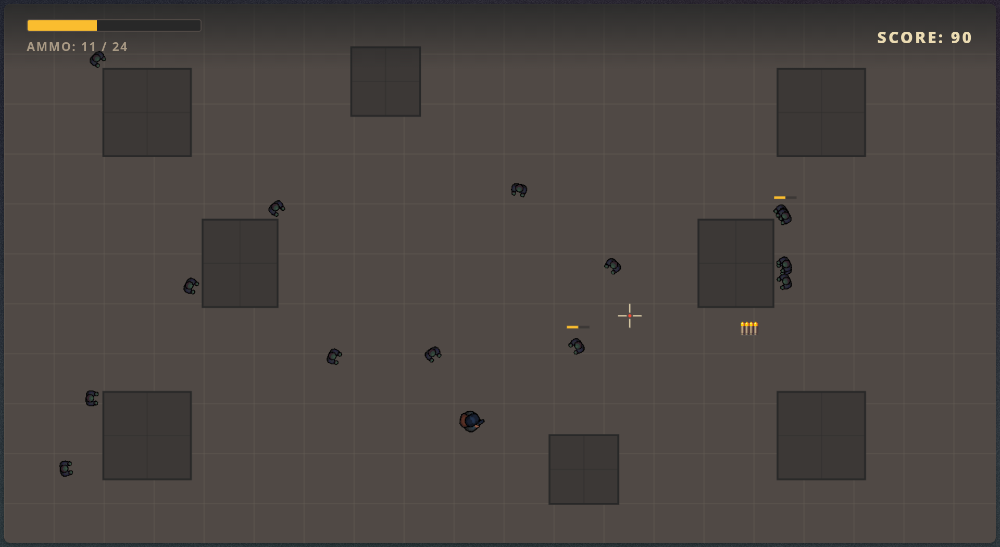

# outbreak

A simple 2D zombie shooter survival game built to run directly in the browser. Play at [outbreak.ayuch.dev](https://outbreak.ayuch.dev/) or clone the repo and run locally.

> [!CAUTION]
> This game is aimed for a keyboard and mouse experience, so mobile devices are intentionally not supported.





# How to run locally

Run a http server with:

```sh
npx -y serve .
```

Or just open `index.html` in a browser.

...

## Project Proposal

This project serves as my Web Fundamentals Project for the UCA Web Development course.

### Description

`Outbreak` is a 2D zombie shooter survival, native to the web browser and developed with only html, css and js. The goal in the game is very simple: You try to survive the constantly spawning zombies for as long as you can. The game offers 3 difficulties that change how many bullets each zombie takes before dying, how fast the zombies can move and how fast they can spawn.

The player can move using the keyboard with <kbd>W</kbd> <kbd>A</kbd> <kbd>S</kbd> <kbd>D</kbd> keys. Aim and shoot using the mouse, reload their weapon, collect health and ammunition pickups dropped by killing zombies. The game also records the player's highest score using browser local storage.

### Goals

The main goals of the project are:

- Create a playable 2D game that runs directly in a web browser.
- Provide Keyboard and mouse controls for movement, aiming, shooting, and reloading.
- Implement progressively challenging zombie encounter.
- Include a menu, difficulty selection, HUD, and game over screen.
- Add health and ammunition pickups.
- Add collision detection between the player, zombie, bullets, and obstacles.
- Track and save player's high score using browser local storage.

### Specification

#### Functional Requirements

The game must:

- Display a main menu when it loads.
- Allow the player to choose `Easy`, `Medium`, or `Hard` difficulty.
- Start a new game when the player selects the start button.
- Allow movement using <kbd>W</kbd><kbd>A</kbd><kbd>S</kbd><kbd>D</kbd> or the arrow keys.
- Allow the player to aim using the mouse.
- Allow the player to shoot using the left mouse button.
- Allow the player to reload using the <kbd>R</kbd> key.
- Spawn zombies from the edges of the screen.
- Allow bullets to damage and kill zombies.
- Allow zombies to damage the player when they get too close.
- Allow zombies to randomly drop health/ammunition pickups on death.
- Increase the score when zombies are defeated.
- Display the player's current health, ammunition, and score.
- End the game when the player's health reaches zero.
- Display the final score and saved high score.
- Allow the player to restart the game or return to the main menu.

### Design

#### User interface

The game contains three main interface states:

- Main menu: displays the game title, difficulty selection, start button and help tips about controls.
- Game screen HUD: displays the player's health, ammunition, and score while in game.
- Game over screen: displays the final score, high score, and options to either restart the game or return to the main menu.

#### Technical design

The code is divided into separate JS modules:

```plaintext
js/
├── bullet.js       # handles bullet movement, collision and visual
├── collision.js    # handles collision detection and movement collision.
├── config.js       # defines difficulty settings and item drop probabilities.
├── gameEngine.js   # Brain of the game. controls the game state, update loop, rendering, spawning, score management, and user interfaces.
├── input.js        # handles keyboard and mouse inputs.
├── main.js         # Main entry point, orchestrates the game and handles canvas resizing.
├── obstacle.js     # defines the arena obstacle objects.
├── pickup.js       # handles the health/ammunition pickups
├── player.js       # handles player movement, shooting, health, ammunition, and reloading.
├── screenShake.js  # creates a screen shake effect upon collision of player and zombies
├── storage.js      # saves and loads the high score using localStorage.
├── vector.js       # vector normalization helpers for smooth movements.
└── zombie.js       # handles zombie movement, health, damage, and rendering.
```

The game uses the HTML5 Canvas API for rendering and `requestAnimationFrame()` for the game loop.

### Future improvements

Possible future additions may include: (but not limited to)

- Additional zombie types with different behaviours.
- Multiple weapons.
- More arena layouts.
- Sound effects and background music.
- A pause menu.
- More advanced enemy pathfinding.

## LICENSE

The project is licensed under [MIT LICENSE](./LICENSE)
